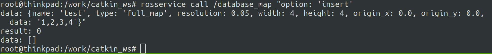
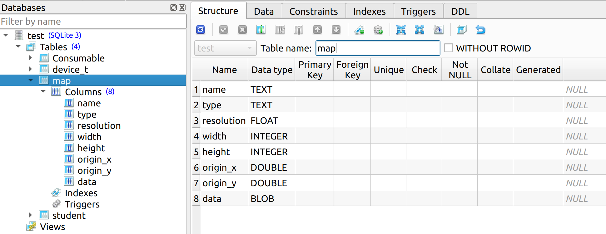
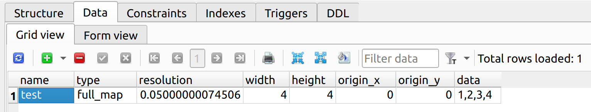

# SQLITE ON ROS

在 ROS 下面方便的使用 sqlite 数据库，不再需要拼接 sql 语句，统一 API 操作，只需要两行代码，就可以搞定数据库操作。

# 简介

使用 ROS service 作为服务端，其它 ROS 节点作为 client 端，通过 service call 的方式来执行对数据库的操作。

# 快速示例

## 代码添加

1. 添加 msg 文件

```yaml
# type
string FULL_MAP = full_map
string VIRTUAL_WALL_MAP = virtual_wall_map

string name
string type
float32 resolution
uint32 width
uint32 height
float64 origin_x
float64 origin_y
uint8[] data
```

2. 添加 srv 文件

```yaml
# option
string INSERT = insert
string DELETE = delete
string UPDATE = update
string SELECT = select

string option          # 必选字段
ros_sqlite_database/map data  # 变量名必须为 data, 类型自定义
---
uint8 result
ros_sqlite_database/map[] data
```

3. include/ros_sqlite_database/message_type.hpp 定义数据库表结构

```c++
// 第一个为数据库表名称，需要与 msg 文件名一致，后面为数据库键值
REFLECTION(map, name, type, resolution, width, height, origin_x, origin_y, data)
```

4. 创建 service 服务对象即可

```C++
ros::NodeHandle nh;
database::DatabaseService<ros_sqlite_database::database_map> map_service(nh, "database_map");
```

## 运行示例

1. 终端执行 service call 添加操作



2. 使用 sqlitestudio 打开 test.db 文件（默认路径 /work/catkin_ws/test.db）即可查看新加的数据
* 表结构


* 数据

